<link rel="stylesheet" href="./style.css" type="text/css">

## Ableton Liveでの ドラムの打ち込み方
---
<!-- .slide: class="little-text" -->
Ableton Liveを起動します
 
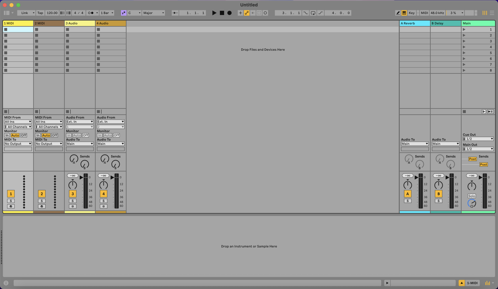
<!-- .element: style="height: 15em; margin-bottom: 4em;" -->

起動した直後はセッションビューで起動します。
<!-- .element: style="margin-bottom: 0;" -->
(インストール直後の本当の初回はデモソングが開きます)
<!-- .element: style="font-size:0.5em;margin: 0;" -->
Ableton Liveには

- セッションビュー
- アレンジメントビュー

があります。

---
「tab」キーで セッションビューとアレンジメントビュー の切り替えができます。

<figure>

<figcaption>セッションビュー</figcaption>
</figure>
<figure>
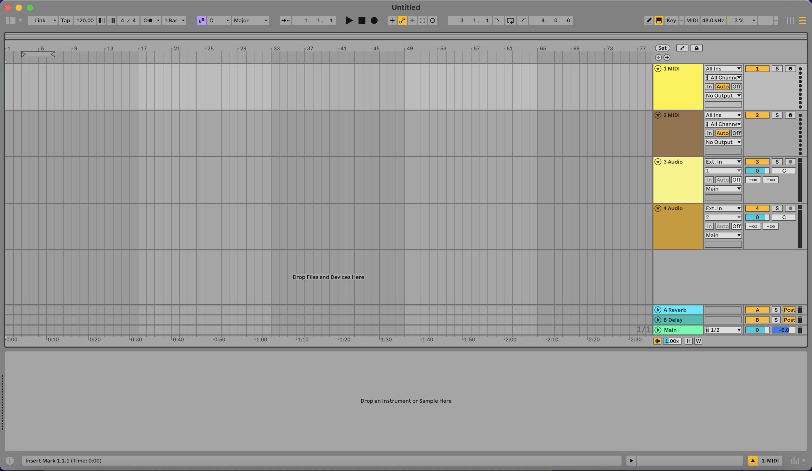
<figcaption>アレンジメントビュー</figcaption>
</figure>

---
<!-- .slide: class="little-text" -->

今回はアレンジメントビューを使用します。

一般的なDAWと同じような使い方で使用できるモード(ビュー)です。
---
MIDIトラック2つとAudioトラック2つが作られた空のセットです。

見やすくするためにMIDIトラックを1つにします。 
必要のないトラックを削除します。

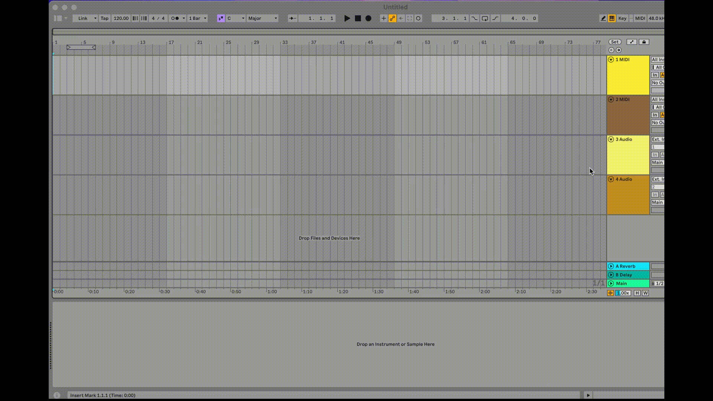
<!-- .element: style="height: 12em;"  -->
Shiftで複数のトラックを選択して、 Delete(WindowsではBackspace)で削除します。

---
左上の四角マークのボタンでブラウザのオン/オフができます。

ブラウザーからDrums > Gen Purpose Kitを選びます。
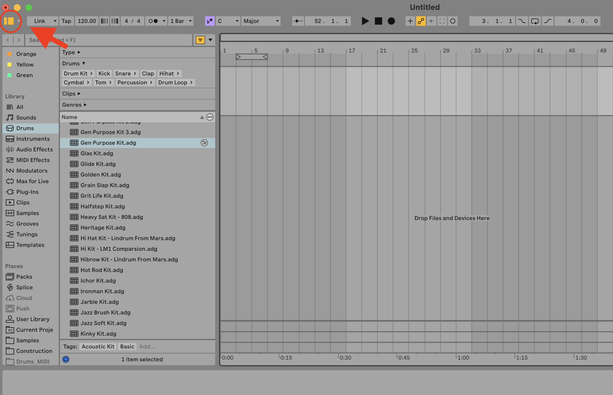
<!-- .element: style="height: 12em; margin-bottom:2em;"  -->
ダブルクリックで選択できます。
---
Gen Purpose Kit (生ドラムの音源)が開きます。

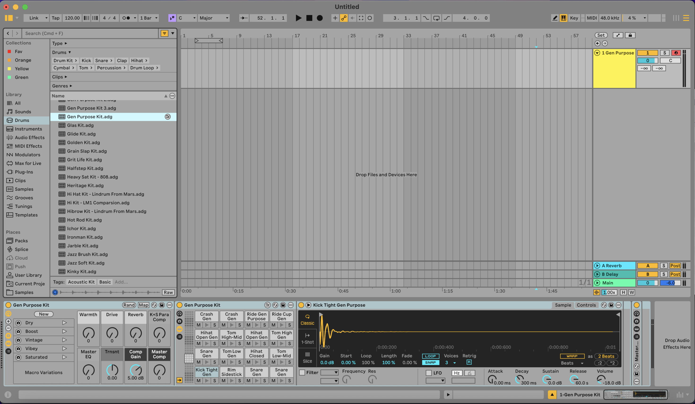
---
ブラウザを閉じます。 
左上の四角マークでも開いたり閉じたりできますが、
「Command」+「Option」+ B でブラウザを閉じられます。
<!-- .element: style="font-size:0.7em" -->

下に表示されているデバイスリストも閉じます。 
右下の三角のマークでも閉じられますが、 
「Command」+「Option」+ Lでも閉じられます。
<!-- .element: style="font-size:0.7em" -->
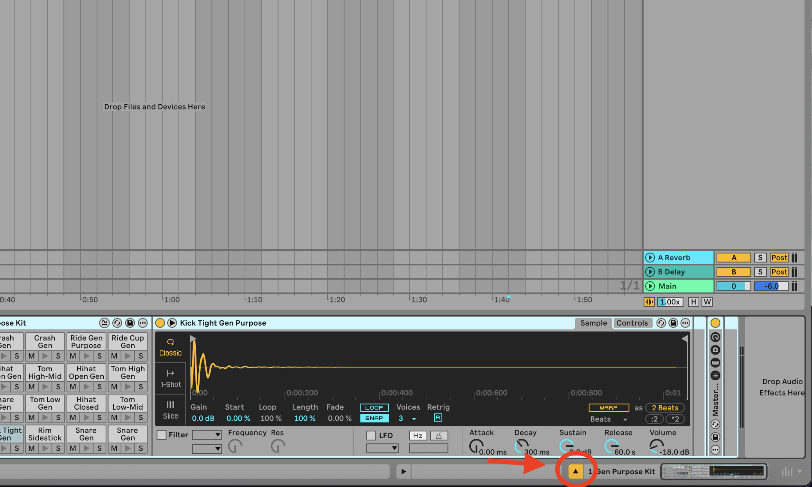

<!-- .element: style="height: 9em;"  -->

Ableton Liveでは「Command」+「Option」+ 「L」or「I」or「M」or「B」or「O」 
で色々開いたり閉じたり出来ます。
<!-- .element: style="font-size:0.7em" -->

いろいろ押してみましょう。
<!-- .element: style="font-size:0.7em" -->
---
小節がこのバー（ルーラーと呼びます）で表示されています。 

このルーラー自体をマウスで上下することで タイムラインを拡大したり縮小したりできます。

<figure>
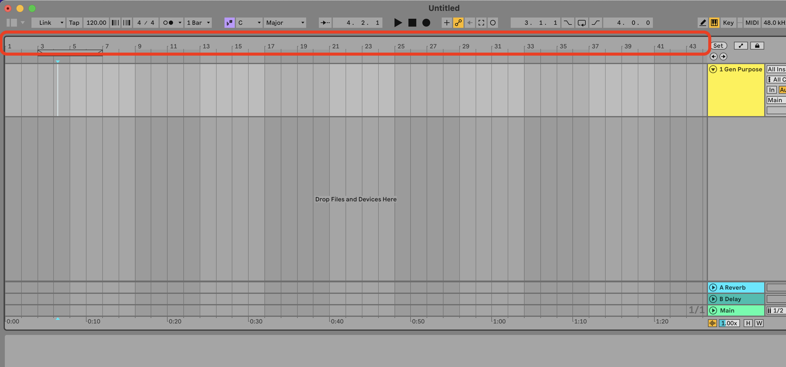
</figure>
<figure>
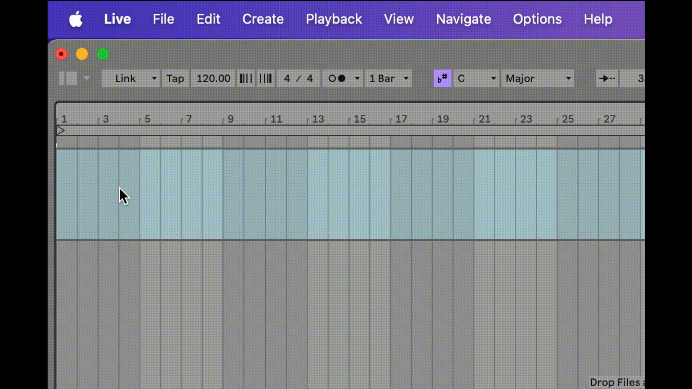
</figure>

---
<!-- .slide: class="little-text" -->

メニューバーの「Create」から「MIDIクリップを作成」を選びます。 

<figure>
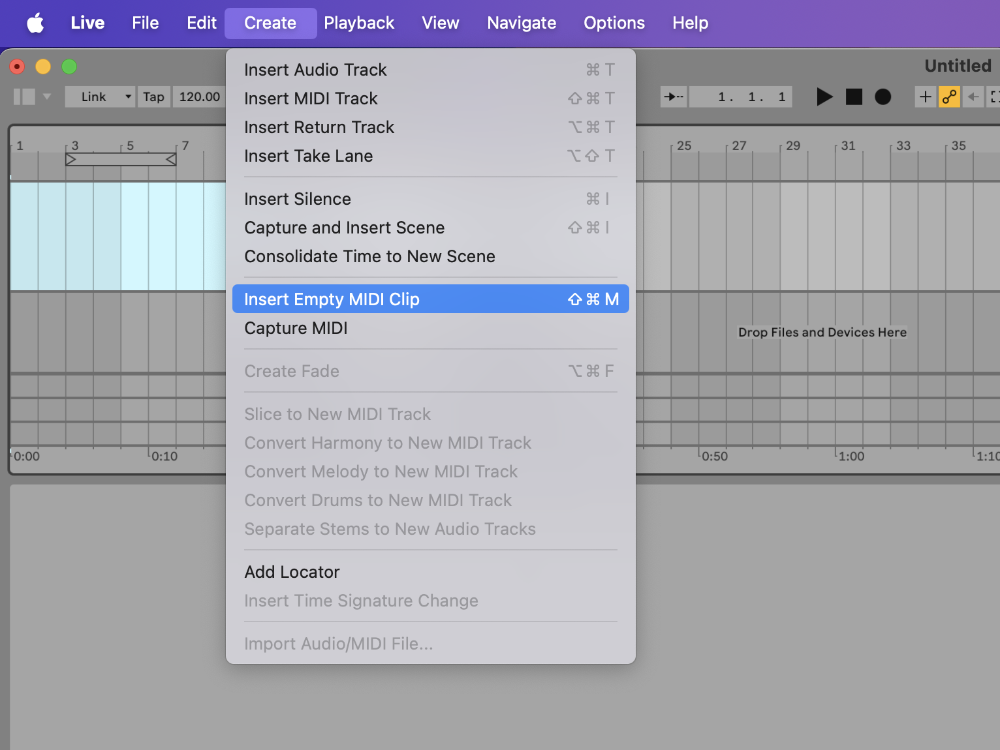
</figure>
<figure>
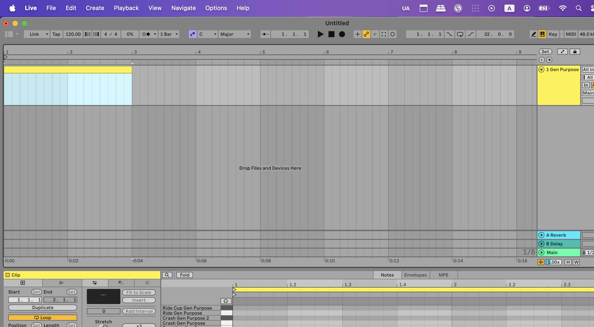
<figcaption style="font-size:0.5em;">空のクリップが作成されます</figcaption>
</figure>

「Command」+「Shift」+ 「M」で出来ます。

 とてもよく使うショートカットなのでこれは覚えましょう！
---
<!-- .slide: class="little-text" -->

クリップビューを開いてください。 
(クリップを開くと自動で開きます。クリップの上部をダブルクリックで開けます。

クリップビューのサイズを大きくします。 
境界をマウスでクリックして上下することでサイズ変更できます。

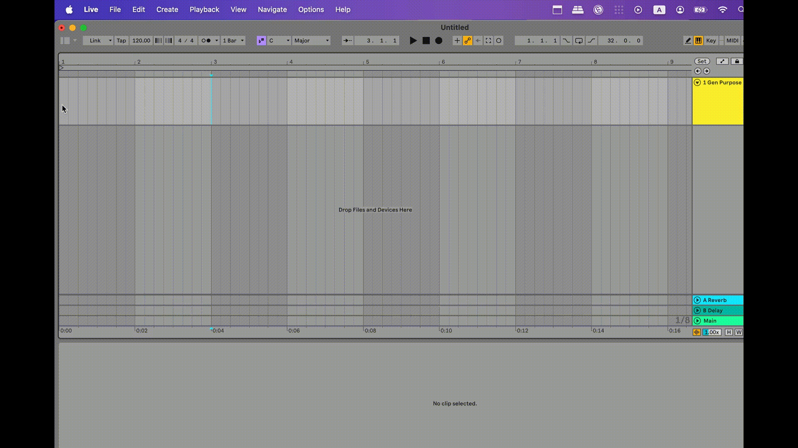
