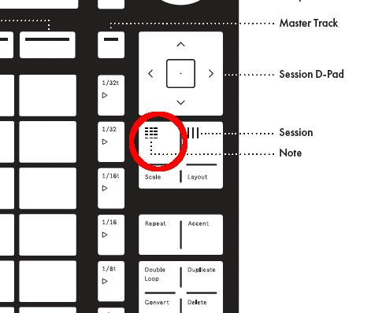
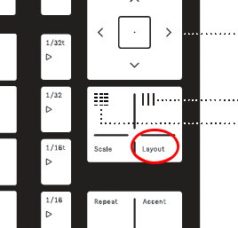
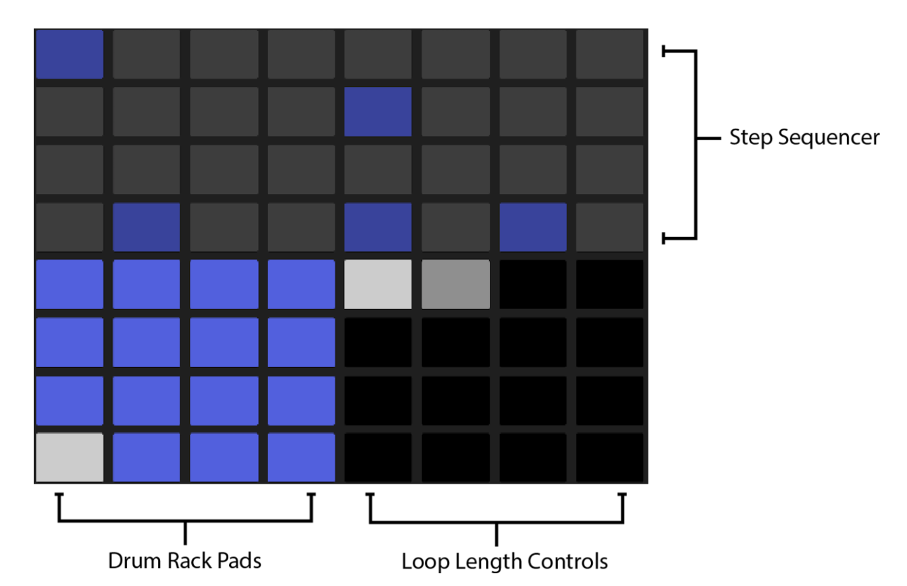
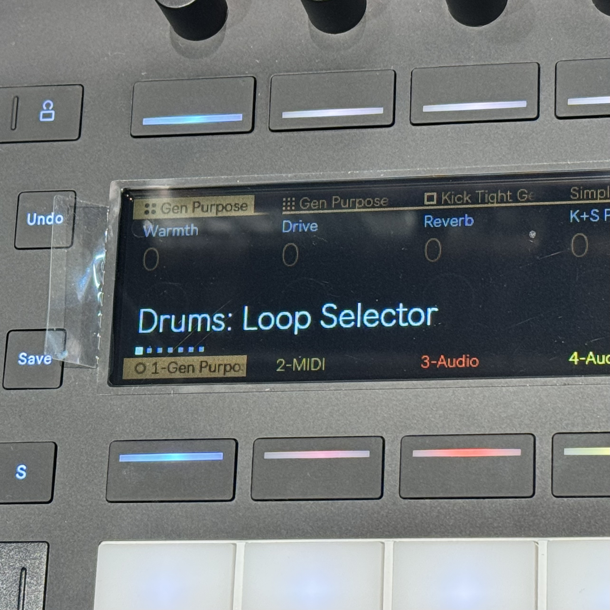
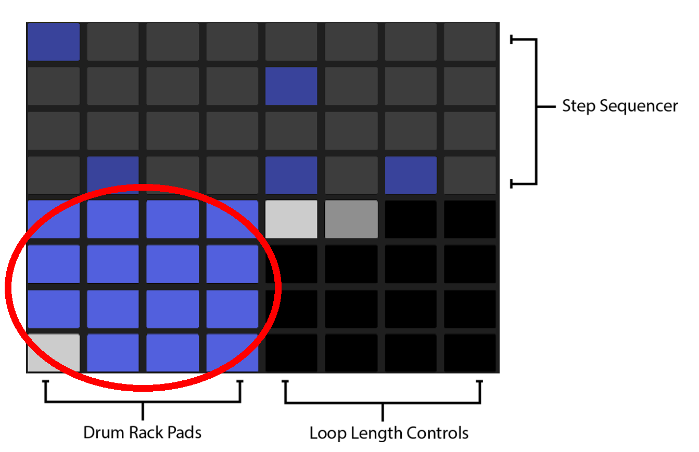
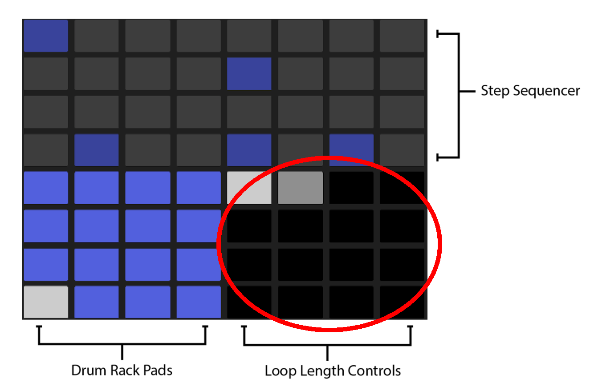
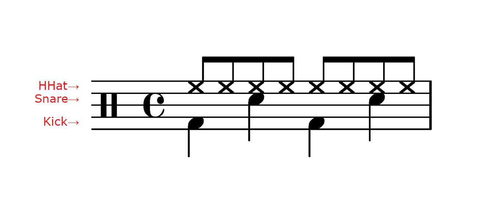

## Push 3 Standaloneでドラムを打ち込む
---

Noteボタンを押して、Noteモードに切り替えます。

---
Lower Display Buttons(画面の下のボタン)でドラムトラックを選択する
 
<a href="./push_controls.html" style="font-size: 0.3em">Pushの各部の名称はこちらをご確認ください</a>
 

---

Layoutボタンを数回押して、「Loop Selector」のモードにする

 

 

↑Loop Selectorのレイアウト

---

Drums Rack Pads(Loop Selector Layout上)で 打ち込む音を選ぶ 
キック、スネア、ハイハットなど

 
↑Loop Selectorのレイアウト

---
「Loop Length Control」(Loop Selector Layout上)の 左上のマスをダブルタップする 
この操作で1小節のループを作成するモードになります。

1マスが1小節になっていて、マスをタップしながら別のマスをタップすることで、小節の長さを変更できます。

 
↑Loop Selectorのレイアウト

---

「Step Sequencer」(Loop Selector レイアウト上)の上2列が1小節16beatのシーケンサーになっています。

音を打ち込んでみましょう！

 
↑Loop Selectorのレイアウト

<a href="./" style="font-size:0.5em; text-align:left; display:block; margin-left: -6em;">項目一覧へ</a>
---
### 打ち込んでみましょう！

例:

<figure>
 
<figcaption style="font-size: 0.2em">同じリズムの曲: Vaundy/踊り子(BPM:157)</figcaption>
</figure>

