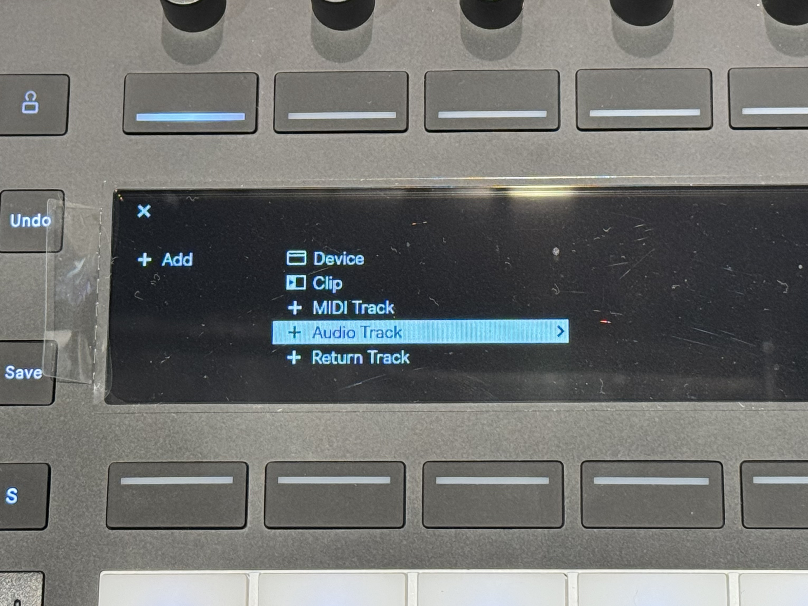
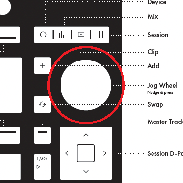

# Push 3 Standaloneでギター/ベースを録音する

---

まずAudioトラックを作成します。

ジョグホイールの左上の「+」ボタンを押します。

---

ジョグホイールで「+Audio Track」を選択して、オーディオトラックを追加します。

<figure>

<figcaption style="font-size: 0.5em;">↑ジョグホイールはこれです</figcaption>
</figure>

